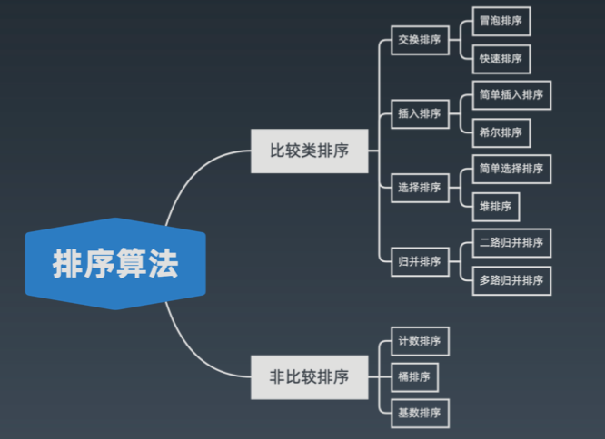
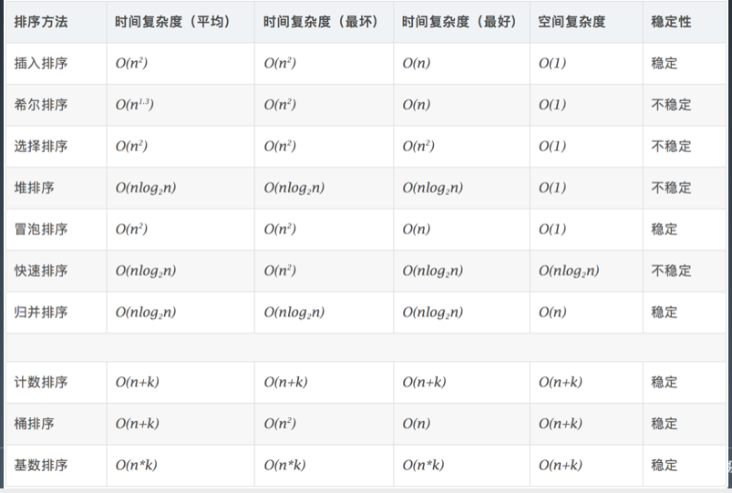

#  排序算法

## 初级排序和高级排序的实现和特性

排序算法

1. 比较类排序: 通过比较来决定元素间的相对次序，由于其时间复杂度不能突破

O(nlogn)，因此也称为非线性时间比较类排序。

2. 非比较类排序:

不通过比较来决定元素间的相对次序，它可以突破基于比较排序的时 间下界，以线性时间运行，因此也称为线性时间非比较类排序。

### 排序算法

* 排序算法
  * 比较类排序
    * 交换排序
      * 冒泡排序
      * 快速排序
    * 插入排序
      * 简单插入排序
      * 希尔排序
    * 选择排序
      * 简单选择排序
      * 堆排序
    * 归并排序
      * 二路归并排序
      * 多路归并排序
  * 非比较排序
    * 计数排序
    * 桶排序
    * 基数排序



### 时间复杂度



### 初级排序 - O(n^2)

1. 选择排序(Selection Sort) 每次找最小值，然后放到待排序数组的起始位置。
2. 插入排序(Insertion Sort) 从前到后逐步构建有序序列;对于未排序数据，在已排序序列中从后 向前扫描，找到相应位置并插入。
3. 冒泡排序(Bubble Sort) 嵌套循环，每次查看相邻的元素如果逆序，则交换。

### 高级排序 - O(N*LogN)

* **快速排序(Quick Sort)**

数组取标杆 pivot，将小元素放 pivot左边，大元素放右侧，然后依次 对右边和右边的子数组继续快排;以达到整个序列有序。

```java
// Java
public static void quickSort(int[] array, int begin, int end) {
    if (end <= begin) return;
    int pivot = partition(array, begin, end);
    quickSort(array, begin, pivot - 1);
    quickSort(array, pivot + 1, end);
}
static int partition(int[] a, int begin, int end) {
    // pivot: 标杆位置，counter: 小于pivot的元素的个数
    int pivot = end, counter = begin;
    for (int i = begin; i < end; i++) {
        if (a[i] < a[pivot]) {
            int temp = a[counter]; a[counter] = a[i]; a[i] = temp;
            counter++;
        }
    }
    int temp = a[pivot]; a[pivot] = a[counter]; a[counter] = temp;
    return counter;
}

```


* **归并排序(Merge Sort)— 分治**

1. 把长度为n的输入序列分成两个长度为n/2的子序列; 
2. 对这两个子序列分别采用归并排序;
3. 将两个排序好的子序列合并成一个最终的排序序列。

```java
// Java
public static void mergeSort(int[] array, int left, int right) {
    if (right <= left) return;
    int mid = (left + right) >> 1; // (left + right) / 2
    mergeSort(array, left, mid);
    mergeSort(array, mid + 1, right);
    merge(array, left, mid, right);
}
public static void merge(int[] arr, int left, int mid, int right) {
        int[] temp = new int[right - left + 1]; // 中间数组
        int i = left, j = mid + 1, k = 0;
        while (i <= mid && j <= right) {
            temp[k++] = arr[i] <= arr[j] ? arr[i++] : arr[j++];
        }
        while (i <= mid)   temp[k++] = arr[i++];
        while (j <= right) temp[k++] = arr[j++];
        for (int p = 0; p < temp.length; p++) {
            arr[left + p] = temp[p];
        }
        // 也可以用 System.arraycopy(a, start1, b, start2, length)
    }
```

**归并 和 快排 具有相似性，但步骤顺序相反**

归并:先排序左右子数组，然后合并两个有序子数组 

快排:先调配出左右子数组，然后对于左右子数组进行排序

* **堆排序(Heap Sort) — 堆插入 O(logN)，取最大/小值 O(1)**

1. 数组元素依次建立小顶堆 
2. 依次取堆顶元素，并删除

```java
// Java
static void heapify(int[] array, int length, int i) {
    int left = 2 * i + 1, right = 2 * i + 2；
    int largest = i;
    if (left < length && array[left] > array[largest]) {
        largest = left;
    }
    if (right < length && array[right] > array[largest]) {
        largest = right;
    }
    if (largest != i) {
        int temp = array[i]; array[i] = array[largest]; array[largest] = temp;
        heapify(array, length, largest);
    }
}
public static void heapSort(int[] array) {
    if (array.length == 0) return;
    int length = array.length;
    for (int i = length / 2-1; i >= 0; i-) 
        heapify(array, length, i);
    for (int i = length - 1; i >= 0; i--) {
        int temp = array[0]; array[0] = array[i]; array[i] = temp;
        heapify(array, i, 0);
    }
}
```


### 特殊排序 - O(n)

* 计数排序(Counting Sort) 

  计数排序要求输入的数据必须是有确定范围的整数。将输入的数据值转化为键存 储在额外开辟的数组空间中;然后依次把计数大于 1 的填充回原数组

* 桶排序(Bucket Sort)
  桶排序 (Bucket sort)的工作的原理:假设输入数据服从均匀分布，将数据分到有 限数量的桶里，每个桶再分别排序(有可能再使用别的排序算法或是以递归方式 继续使用桶排序进行排)。

* 基数排序(Radix Sort) 

  基数排序是按照低位先排序，然后收集;再按照高位排序，然后再收集;依次类 推，直到最高位。有时候有些属性是有优先级顺序的，先按低优先级排序，再按 高优先级排序。

## 排序的实战练习题

#### [1122. 数组的相对排序](https://leetcode-cn.com/problems/relative-sort-array/)

```java
class Solution {
    public int[] relativeSortArray(int[] arr1, int[] arr2) {
        int[] m = new int[1001];
        int[] ref = new int[arr1.length];
        for(int i = 0; i < arr1.length; i++) {
            m[arr1[i]]++;
        }
        int cnt = 0;
        for(int i = 0; i < arr2.length; i++) {
            while(m[arr2[i]] > 0) {
                ref[cnt++] = arr2[i];
                m[arr2[i]]--;
            }
        }   
        for(int i = 0; i < 1001; i++) {
            while(m[i] > 0) {
                ref[cnt++] = i;
                m[i]--;
            }
        }
        return ref;
    }
}
```

#### [242. 有效的字母异位词](https://leetcode-cn.com/problems/valid-anagram/)

```java
class Solution {
    public boolean isAnagram(String s, String t) {
        int[] arr = new int[26];
        for (char c : s.toCharArray()) arr[c - 'a']++;
        for (char c : t.toCharArray()) arr[c - 'a']--;
        for (int i : arr) if (i != 0) return false;
        return true;
    }
}
```

#### [56. 合并区间](https://leetcode-cn.com/problems/merge-intervals/)

```java
class Solution {
    public int[][] merge(int[][] intervals) {
        // 先按照区间起始位置排序
        Arrays.sort(intervals, (v1, v2) -> v1[0] - v2[0]);
        // 遍历区间
        int[][] res = new int[intervals.length][2];
        int idx = -1;
        for (int[] interval: intervals) {
            // 如果结果数组是空的，或者当前区间的起始位置 > 结果数组中最后区间的终止位置，
            // 则不合并，直接将当前区间加入结果数组。
            if (idx == -1 || interval[0] > res[idx][1]) {
                res[++idx] = interval;
            } else {
                // 反之将当前区间合并至结果数组的最后区间
                res[idx][1] = Math.max(res[idx][1], interval[1]);
            }
        }
        return Arrays.copyOf(res, idx + 1);
    }
}

```

```java
class Solution {
    public int[][] merge(int[][] intervals) {
        LinkedList<int[]> res = new LinkedList<>();
        if (intervals == null || intervals.length == 0) {
            return res.toArray(new int[0][]);
        }

        Arrays.sort(intervals, new Comparator<int[]>() {
            @Override
            public int compare(int[] o1, int[] o2) {
                return o1[0] - o2[0];
            }
        });

        for (int i = 0; i < intervals.length; i++) {
            if (res.isEmpty() || res.getLast()[1] < intervals[i][0]) {
                res.add(intervals[i]);
            } else {
                res.getLast()[1] = Math.max(res.getLast()[1], intervals[i][1]);
            }
        }

        //为什么放0，0长度？可以看下源码就知道了
        return res.toArray(new int[0][0]);
    }
}

```

#### [493. 翻转对](https://leetcode-cn.com/problems/reverse-pairs/)