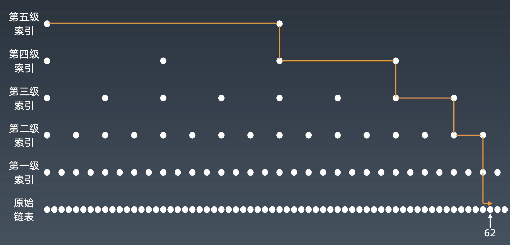
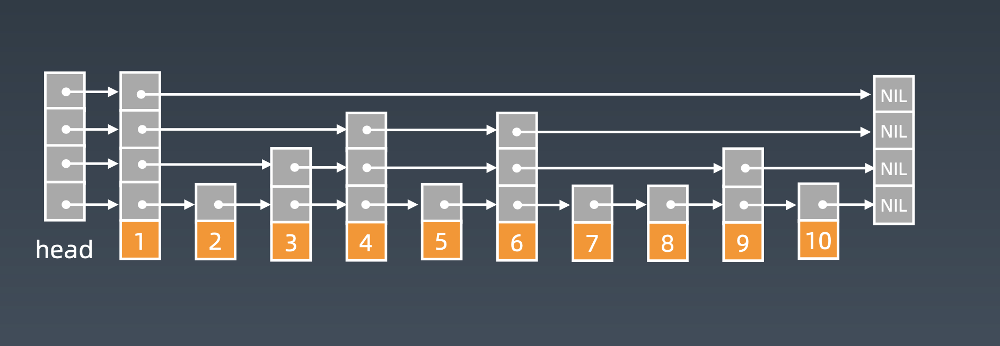

# 数组、链表、跳表的基本实现和特性

## 数组

**为什么很多编程语言中数组都从0开始编号？**

从数组存储的内存模型上来看，“下标”最确切的定义应该是“偏移（offset）”。前面也讲到，如果用 a 来表示数组的首地址，a[0] 就是偏移为 0 的位置，也就是首地址，a[k] 就表示偏移 k 个 type_size 的位置，所以计算 a[k] 的内存地址只需要用这个公式：

```java
a[k]_address = base_address + k * type_size
```

但是，如果数组从 1 开始计数，那我们计算数组元素 a[k] 的内存地址就会变为：

```java
a[k]_address = base_address + (k-1)*type_size
```

对比两个公式，我们不难发现，从 1 开始编号，每次随机访问数组元素都多了一次减法运算，对于 CPU 来说，就是多了一次减法指令。

### 随机访问

**数组（Array）是一种线性表数据结构。它用一组连续的内存空间，来存储一组具有相同类型的数据。**

* `线性表`：线性表就是数据排成像一条线一样的结构。每个线性表上的数据最多只有前和后两个方向。其实除了数组，链表、队列、栈等也是线性表结构。
* `连续的内存空间和相同类型的数据`。

正是因为这两个限制，它才有了一个堪称“杀手锏”的特性：“**随机访问**”。

我们知道，计算机会给每个内存单元分配一个地址，计算机通过地址来访问内存中的数据。当计算机需要随机访问数组中的某个元素时，它会首先通过下面的寻址公式，计算出该元素存储的内存地址：

```java
a[i]_address = base_address + i * data_type_size
```

### 低效的“插入”和“删除”

**插入**：如果我们需要将一个数据插入到数组中的第 k 个位置。为了把第 k 个位置腾出来，给新来的数据，我们需要将第 k～n 这部分的元素都顺序地往后挪一位。

如果要将某个元素插入到第 k 个位置，为了避免大规模的数据搬移，我们还有一个简单的办法就是，**直接将第 k 位的数据搬移到数组元素的最后，把新的元素直接放入第 k 个位置。**

**删除**：如果我们要删除第 k 个位置的数据，为了内存的连续性，也需要搬移数据，不然中间就会出现空洞，内存就不连续了。

实际上，在某些特殊场景下，我们并不一定非得追求数组中数据的连续性。如果我们将多次删除操作集中在一起执行，删除的效率是不是会提高很多呢？

我们可以先记录下已经删除的数据，每次的删除操作并不是真正地搬移数据，只是记录数据已经被删除。当数组没有更多空间存储数据时，我们再触发执行一次真正的删除操作，这样就大大减少了删除操作导致的数据搬移。

### 警惕数组的访问越界问题

但 Java 本身会做越界检查，抛出java.lang.ArrayIndexOutOfBoundsException。

### 容器能否完全替代数组？

ArrayList 最大的优势就是**可以将很多数组操作的细节封装起来**。比如前面提到的数组插入、删除数据时需要搬移其他数据等。另外，它还有一个优势，就是**支持动态扩容**。

但扩容操作涉及内存申请和数据搬移，是比较耗时的。所以，如果事先能确定需要存储的数据大小，最好**在创建 ArrayList 的时候事先指定数据大小**。

`什么时候使用数组更为合适`：

1. Java ArrayList 无法存储基本类型，比如 int、long，需要封装为 Integer、Long 类，而 Autoboxing、Unboxing 则有一定的性能消耗，所以如果特别关注性能，或者希望使用基本类型，就可以选用数组。
2. 如果数据大小事先已知，并且对数据的操作非常简单，用不到 ArrayList 提供的大部分方法，也可以直接使用数组。
3. 还有一个是我个人的喜好，当要表示多维数组时，用数组往往会更加直观。比如 Object[][] array；而用容器的话则需要这样定义：ArrayList<ArrayList > array。

**总结一下**，对于业务开发，直接使用容器就足够了，省时省力。毕竟损耗一丢丢性能，完全不会影响到系统整体的性能。但如果你是做一些非常底层的开发，比如开发网络框架，性能的优化需要做到极致，这个时候数组就会优于容器，成为首选。

## 链表

链表通过“指针”将一组**零散的内存块**串联起来使用。

#### 单链表

尾结点的指针不是指向下一个结点，而是指向一个**空地址NULL**，表示这是链表上最后一个结点。

链表的插入和删除操作**时间复杂度为O(1)**。

随机访问的**时间复杂度为O(n)**。

#### 循环链表是一种特殊的单链表

唯一的区别为尾结点指针是**指向链表的头结点**。

与单链表相比的优点是 **从链尾到链头比较方便**。当要处理的数据具有环形结构特点时，就特别适合循环链表。

#### 双向链表

它支持两个方向，每个结点不止有一个后继指针 next 指向后面的结点，还有一个前驱指针 prev 指向前面的结点。

使双向链表在某些情况下的插入、删除等操作都要比单链表简单、高效。

## 数组与链表对比

| 时间复杂度 | 数组 | 链表 |
| ---------- | ---- | ---- |
| 插入、删除 | O(n) | O(1) |
| 随机访问   | O(1) | O(n) |

数组简单易用，在实现上使用的是连续的内存空间，可以借助 CPU 的缓存机制，预读数组中的数据，所以访问效率更高。而链表在内存中并不是连续存储，所以对 CPU 缓存不友好，没办法有效预读。

数组的缺点是大小固定，一经声明就要占用整块连续内存空间。如果声明的数组过大，系统可能没有足够的连续内存空间分配给它，导致“内存不足（out of memory）”。

### LRU缓存淘汰算法

缓存的大小有限，当缓存被用满时，哪些数据应该被清理出去，哪些数据应该被保留？这就需要缓存淘汰策略来决定。

常见的策略有三种：

* 先进先出策略 FIFO（First In，First Out）
* 最少使用策略 LFU（Least Frequently Used）
* 最近最少使用策略 LRU（Least Recently Used）。

我们维护一个有序单链表，越靠近链表尾部的结点是越早之前访问的。当有一个新的数据被访问时，我们从链表头开始顺序遍历链表。

1. 如果此数据之前已经被缓存在链表中了，我们遍历得到这个数据对应的结点，并将其从原来的位置删除，然后再插入到链表的头部。

2. 如果此数据没有在缓存链表中，又可以分为两种情况：

- 如果此时缓存未满，则将此结点直接插入到链表的头部；
- 如果此时缓存已满，则链表尾结点删除，将新的数据结点插入链表的头部。

### **几个写链表代码技巧**

* 理解指针或引用的含义
* 警惕指针丢失和内存泄露
* 利用哨兵简化实现难度
  * **针对链表的插入、删除操作，需要对插入第一个结点和删除最后一个结点的情况进行特殊处理**。
  * 如果我们引入哨兵结点，在任何时候，不管链表是不是空，head 指针都会一直指向这个哨兵结点。
  * 哨兵结点是不存储数据的。

* 重点留意边界条件处理
* 举例画图，辅助思考
* 多写多练
  * 单链表反转
  * 链表中环的检测
  * 两个有序的链表合并
  * 删除链表倒数第 n 个结点
  * 求链表的中间结点

#### 如何给链表加速

升维思想

* 添加多级索引  --> 跳表



## 跳表

#### 跳表查询的时间复杂度分析

在跳表中查询任意数据的时间复杂度就是 O(logn)

#### 跳表的空间复杂度分析

空间复杂度是 O(n)

#### 现实中跳表的形态



